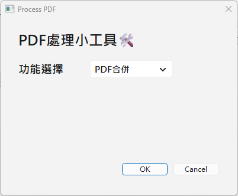
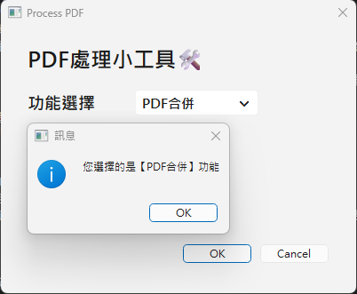
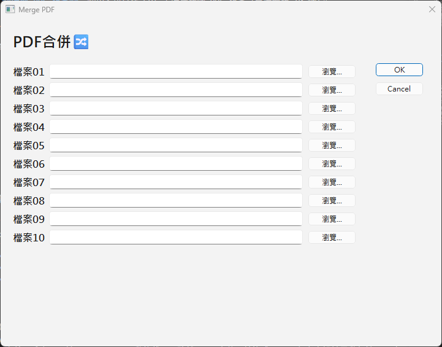
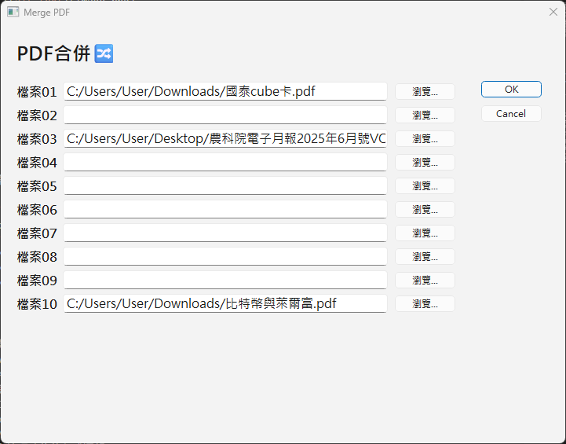
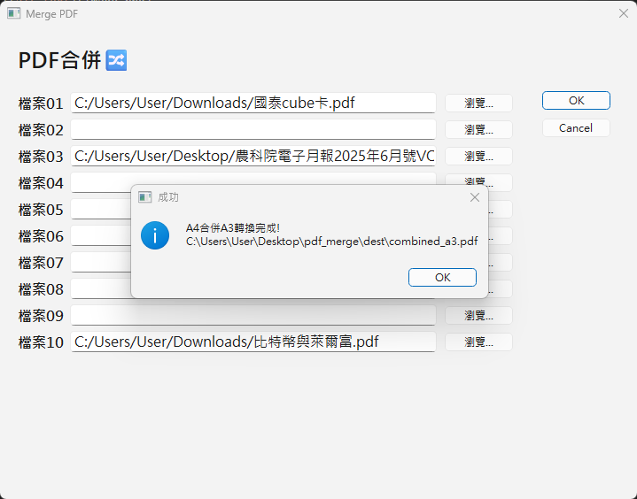
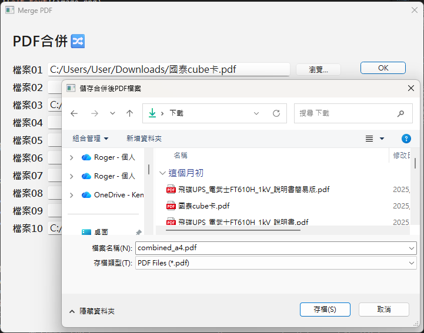
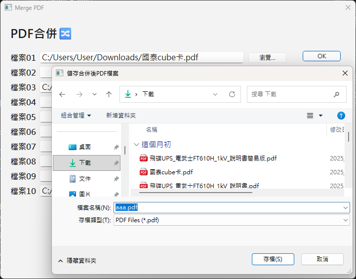
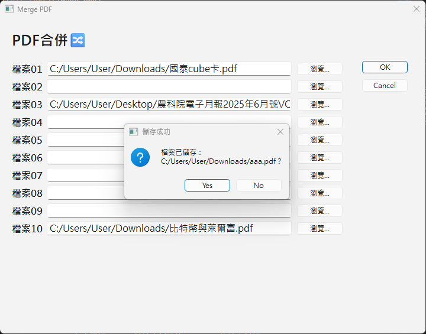
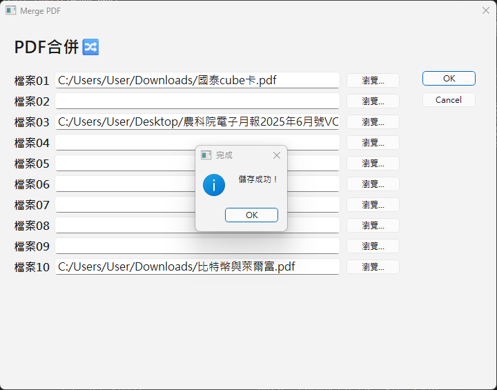

# PDF Manager with PySide6 GUI

## 概述 📖

這個專案構想是，實作簡單的 PDF 文書工具，使用 PySide6 框架建立圖形用戶介面 (GUI)。從原本的單一腳本執行方式 (`pdf_combine.py` 和 `pdf_A4_to_A3.py`)，重構既有程式，並建立 MVC 框架，實現 PDF 檔案的選取、合併和轉換。

## PDF 合併檔案功能 📄

1. **選取 PDF 檔案**：使用者可以在 GUI 上選擇多個 PDF 檔案（支援最多 10 個）。
   - 搭配使用技巧 1：目前的微軟文書編輯軟體 (Word, PowerPoint...)，大多能支援把原始檔案，轉檔成 PDF。
   - 搭配使用技巧 2：Ctrl+P 選取【Microsoft Print to PDF】的頁數範圍，可處理 PDF 特定頁碼的跳頁問題。
2. **輸入檔案到暫存資料夾**：將已選取的檔案複製到 `Desktop\pdf_merge\src` 檔案夾，並變更命名為 `a.pdf`、`b.pdf` 等，以符合合併邏輯。
3. **合併並轉換 PDF**：將 A4 PDF 檔案合併成一個檔案 (限直式 portrait 顯示)，再每兩頁依序轉換為 A3 格式的一頁，兩種檔案都會同時儲存到 `Desktop\pdf_merge\dest` 檔案夾。
4. **取得完成合併 PDF**：跳出本地的檔案目錄視窗，讓使用者自行指定 A4 合併檔、A3 轉換檔的希望下載位置。

<details>
<summary> 🔢 PDF 合併及轉檔功能 GUI 操作步驟 (Click Me!! 使用前必看!!) 🔢 </summary>

   > ### 注意事項
   > - 支援最多 10 個 PDF 檔案，需依序選取檔案。
   > - 確保輸入的是 PDF 檔案，才能合併成單一 A4 格式 (限直式顯示)，並正確轉換為 A3 格式。
   > - A4 合併、A3 轉換前後的檔案都先儲存在桌面，同時也提供指定儲存副本路徑。
   > - 當不再使用主視窗、彈出視窗時，可以點擊右上角 [x] 或【Cancel】結束執行。

   1. 點擊 exe 執行檔，在主畫面的下拉功能，選擇【PDF合併】、【OK】。<br>
   
   
   2. 彈出第二視窗，點擊【瀏覽...】，依序選好要合併的檔案來源，確認後按【OK】。<br>
   
   
   3. 點擊彈窗【OK】表示完成合併。<br>
   
   4. 指定副本檔案的存放位置 (可重新命名)，最後按下【存檔】。<br>
   
   
   
   
</details>

## 安裝或擴充 📦

專案開發時，請確保 PC 有安裝好以下 Python 套件：

```bash
pip install PySide6 pypdf PyMuPDF
```
- **PySide6**：用於創建 GUI 界面。
- **pypdf**：用於 PDF 檔案的讀取和寫入。
- **PyMuPDF**：用於 PDF 格式轉換（A4 到 A3）。

## MVC 架構 🏗️

為提高代碼的可維護性與擴展性，採用 MVC (Model-View-Controller) 架構來建構/重構這個專案
- View：以 PySide6 (C:\Python313\Lib\site-packages\PySide6\designer.exe) 建立的 .ui 文件，定義用戶介面，並用 QUiLoader 動態載入。雖然 .ui 文件可轉換成 .py，但考慮設計異動頻繁，不建議使用指令轉換成 .py。
- Controller：主畫面的程式規則在 main_controller.py，根據使用者選單挑出的功能，分流至各別的 xxx_controller.py，負責溝通 View 前端資料渲染、Model 後端資料調用。
- Model：業務規則已封裝在 `src/models/pdf_model.py` 的 `PDFModel` 中，透過導入模組 pypdf、PyMuPDF 處理讀取及寫入，實踐 PDF 合併、轉換和檔案管理功能的程式邏輯。

## 原始碼檔案結構 📂

```
project/
├─ src/                          #--內部資源--#
│   ├─ main.py                   # 應用程式入口
│   ├─ controllers/              #--Controller--#
│   │   ├─ main_controller.py     # 主視窗控制器
│   │   └─ merge_controller.py    # PDF合併控制器
│   ├─ models/                   #--Model--#
│   │   └─ pdf_model.py           # PDF業務邏輯封裝
│   └─ utils/                    #--工具函數--#
│       └─ paths.py               # 全域路徑定義
├─ resources/                    #--外部資源--#
│   └─ ui/                       #--View--#
│       ├─ pdf_main.ui            # PDF主視窗UI
│       └─ pdf_merge.ui           # PDF合併視窗UI
├─ deploy/                       #--自動化部署--#
│   ├─ build_exe.py               # PyInstaller打包腳本
│   ├─ pdf_manager.spec           # PyInstaller配置
│   ├─ deploy.sh                  # Linux/Mac部署腳本 toCheck
│   ├─ dist/                      # 打包輸出目錄
│   └─ build/                     # PyInstaller臨時文件
├─ .github/workflows/            #--CI/CD配置--#
│   └─ build-release.yml          # GitHub Actions工作流 toCheck
├─ README.md                     #--專案說明(本文內容)--#
├─ DEPLOYMENT_README.md          #--專案說明(部署)--#
└─ docs/                         #--專案文件必要附件--#
    └─ images/                    # 說明圖片
```

## 部署 🚀

### 快速開始
```bash
# 1. 安裝依賴模組
pip install -r requirements.txt

# 2. 打包應用程式
cd deploy
python build_exe.py

# 3. 執行產出檔案
- Windows: .\deploy\dist\PDFManager.exe
- Linux/Mac: ./deploy/dist/PDFManager
```
### 部署選項
#### Windows 環境 _(請在專案根目錄執行)_
```bash
cd deploy 
python build_exe.py
```
#### Linux/Mac 環境 _(請在專案根目錄執行)_ toCheck
```bash
chmod +x deploy/deploy.sh
./deploy/deploy.sh
```
#### CI/CD 自動化 _(推送版本標籤，將自動觸發釋出流程)_ toCheck
```bash
git tag v1.0.0
git push origin v1.0.0
```

**📦 使用 VSCode 實測在 Win11 打包成功**


**📦 輸出**: 可執行檔案位於 deploy/dist/*
- Windows: .exe
- Linux / macOS: 無副檔名


詳見 [完整部署指南](DEPLOYMENT_README.md)


## 技術新里程 🚀

1. **選用 Python GUI 套件種類**：在開發過程時，最終選擇 PySide6 作為 GUI 框架，因為它提供了現代化的 Qt 介面元件，而且具有良好的跨平台支援和豐富的功能。相較於 Python 內建的 Tkinter，根據資料顯示 PySide6 提供了方便的佈局方式和 UX，同時允許用在商用產品的開發。

2. **調整 QDialogButtonBox 按鈕行為控制**：在 PySide6 中，QDialogButtonBox 的 Ok (確定) 按鈕預設會自動關閉對話框（呼叫 accept()）。為避免此行為，使用 disconnect() 移除預設連接，再用 clicked.connect() 自訂處理函式，確保視窗控制權在使用者手中，避免意外關閉。 

3. **理解 Controller 生命週期管理**：在 Python 中，物件可能被垃圾回收器 (GC) 提前清理。將 merge_controller 綁定到 merge_ui 作為實例變數，確保其生命週期與 UI 視窗一致，避免控制器在視窗關閉前被回收，出現類似閃退的不良 UX，維持 GUI 介面上事件處理的穩定性。

4. **選用 PyMuPDF 套件處理 PDF 轉換**：選擇 PyMuPDF (fitz) 而非其他 PDF 處理庫，是因為它能確保，只用單一 PDF 處理套件，可精確控制頁面佈局和轉換。調用 Model 的 `def convert_a4_to_a3` 完成 A4 合併 A3 二合一複雜邏輯時，也同時顧及了頁面尺寸固定、紙張座標方向定義、PDF 渲染解析度維持等。

5. **設計 merge_pdfs 功能限制與驗證**：調用 Model 的 `def merge_pdfs` 時，支援最多 10 個 PDF 原檔案的合併，以及對地端檔案存在驗證、錯誤例外顯示。搭配 QFileDialog.getOpenFileName、getSaveFileName 彈窗介面，實現能任選地端 PDF 檔案，以及指定合併後 A4、A3 下載路徑。

6. **與 GitHub AI Copilot 協作設計 CD 腳本**：這次是首次在個人專案中加入 CD 腳本，與 Github AI Copilot 協作確實加速了開發及學習 CI/CD 的流程設計與理解。透過 PyInstaller 產生 `pdf_manager.spec`，並搭配協作的 `build_exe.py` 腳本，能讓開發者取得這個專案時，快速在本地 PC 完成部署作業。

## 閱讀資源 🔗
- [[Python 練習筆記] PySide6 做一個簡單的GUI Application](https://medium.com/@benson890720/python%E7%B7%B4%E7%BF%92%E7%AD%86%E8%A8%98-pyside6%E5%81%9A%E4%B8%80%E5%80%8B%E7%B0%A1%E5%96%AE%E7%9A%84gui-application-0-%E7%B0%A1%E4%BB%8B%E8%88%87%E8%A8%AD%E5%AE%9A-96c982d8f90)
- [Qt for Python](https://doc.qt.io/qtforpython-6/index.html)
- [pypdf](https://pypdf.readthedocs.io/en/stable/)
- [PyMuPDF](https://pymupdf.readthedocs.io/en/latest/)
- [PyInstaller](https://github.com/pyinstaller/pyinstaller)
